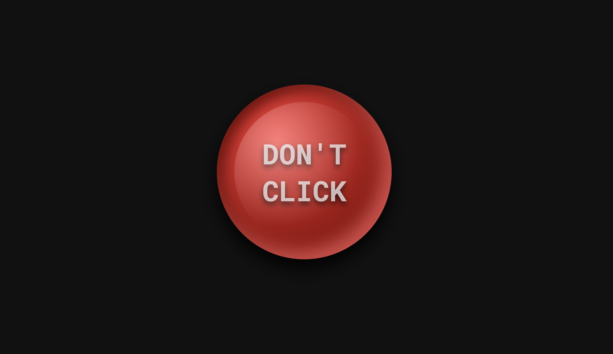

# Clickbaited
a classic red button project with a small twist

## Live Demo
View the Project Here: [https://pari55051.github.io/clickbaited/](https://pari55051.github.io/clickbaited/)

## Overview

### Directions
> "Don't" click on the red button!!

### Features
- a clickable red button
- "Don't" click on the red button or else [redacted] will [censored] for the rest of you life!!

## Images

## Things I Learnt:
- you should use Github, or your projects can be lost in the abyss forever
- Github is not big/experienced devs thing, you should use it. (just creating a account doesnt count, use it!)
- making a lot of [redacted] in HTML/CSS/JS
- giving directions to people, knowing they won't follow it [for example, saying "don't read the secret readme if you don't have permanent amnesia"]
- organising a big project (this is a big project)
- resusication of old projects, adapting them for new ones
- writing readme at 2am

## Credits
- made by: [unowen](https://github.com/pari55051)
- icons: [Phosphoricons](https://phosphoricons.com/)
- red button design from: [here](https://www.youtube.com/shorts/Dc4pIT4I7a0?feature=share)
